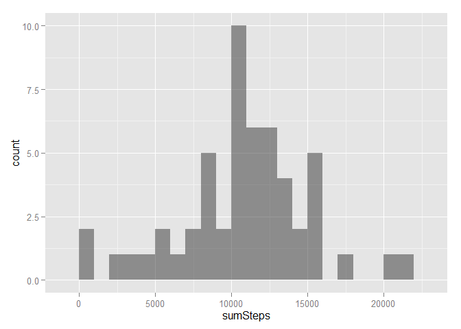
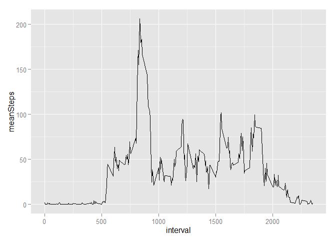

# Reproducible Research: Peer Assessment 1

## Intall Packages

```
## Warning: package 'data.table' was built under R version 3.1.3
```

```
## Warning: package 'xtable' was built under R version 3.1.3
```

```
## data.table     xtable    ggplot2 
##       TRUE       TRUE       TRUE
```

## Loading and preprocessing the data

Show any code that is needed to

1. Load the data (i.e. read.csv())

2. Process/transform the data (if necessary) into a format suitable for your analysis

Read the CSV file. Convert the data frame to a data table using the data.table package


```r
setwd("~/R Programming/Course5")
dt <- read.csv(file.path(getwd(), "activity.csv"))
dt <- data.table(dt)
```


Verify the number of rows loaded is correct.


```r
check <- nrow(dt) == 17568
if (check == FALSE) stop("The number of rows in the dataset is not 17,568.")
```

Convert the `date` variable to a date class.
And look at the structure of the dataset.

```r
dt <- dt[, date := as.Date(date)]
setkey(dt, date, interval)
str(dt)
```

```
## Classes 'data.table' and 'data.frame':	17568 obs. of  3 variables:
##  $ steps   : int  NA NA NA NA NA NA NA NA NA NA ...
##  $ date    : Date, format: "2012-10-01" "2012-10-01" ...
##  $ interval: int  0 5 10 15 20 25 30 35 40 45 ...
##  - attr(*, ".internal.selfref")=<externalptr> 
##  - attr(*, "sorted")= chr  "date" "interval"
```

## What is mean total number of steps taken per day?
For this part of the assignment, you can ignore the missing values in
 the dataset.
 
 1. Make a histogram of the total number of steps taken each day
 
 2. Calculate and report the **mean** and **median** total number of steps taken per day

Aggregate the number of steps taken each day.
Days with missing values (`NA`) will have `NA` when aggregated.


```r
dtDaily <- dt[, list(sumSteps = sum(steps)), date]
head(dtDaily)
```

```
##          date sumSteps
## 1: 2012-10-01       NA
## 2: 2012-10-02      126
## 3: 2012-10-03    11352
## 4: 2012-10-04    12116
## 5: 2012-10-05    13294
## 6: 2012-10-06    15420
```

Plot a histogram of the total number of steps taken each day.


```r
ggplot(dtDaily, aes(x=sumSteps)) +
  geom_histogram(alpha=1/2, binwidth=1000)
```

 

Calculate the mean and median total number of steps taken per day **before imputing**.


```r
tab <- dtDaily[, list(n = .N, nValid = sum(!is.na(sumSteps)), mean = mean(sumSteps, na.rm=TRUE), median = median(sumSteps, na.rm=TRUE))]
print(xtable(tab), type="html", include.rownames=FALSE)
```

<!-- html table generated in R 3.1.2 by xtable 1.7-4 package -->
<!-- Wed May 06 21:44:31 2015 -->
<table border=1>
<tr> <th> n </th> <th> nValid </th> <th> mean </th> <th> median </th>  </tr>
  <tr> <td align="right">  61 </td> <td align="right">  53 </td> <td align="right"> 10766.19 </td> <td align="right"> 10765 </td> </tr>
   </table>

Copy the data table `dtDaily` before imputation to be used later.


```r
dtDaily <- dtDaily[, status := "Before imputation"]
dtDailyBeforeImputation <- dtDaily
```

## What is the average daily activity pattern?

1. Make a time series plot (i.e. `type = "l"`) of the 5-minute interval (x-axis) and the average number of steps taken, averaged across all days (y-axis)

2. Which 5-minute interval, on average across all the days in the dataset, contains the maximum number of steps?

Aggregate the average number of steps taken by 5-minute interval.


```r
dtIntervals <- dt[, list(meanSteps = mean(steps, na.rm=TRUE)), interval]
```

Plot a time series of the 5-minute interval and the average number of steps taken across all days.


```r
ggplot(dtIntervals, aes(x=interval, y=meanSteps)) +
  geom_line()
```

 

## Imputing missing values


## Are there differences in activity patterns between weekdays and weekends?
